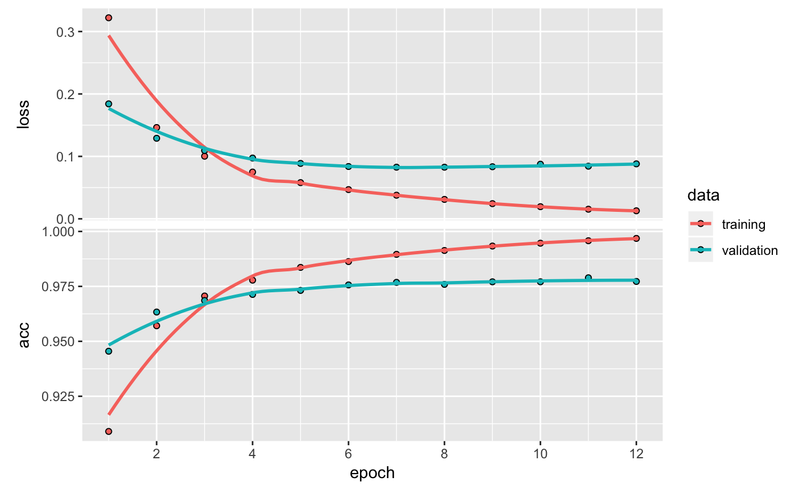
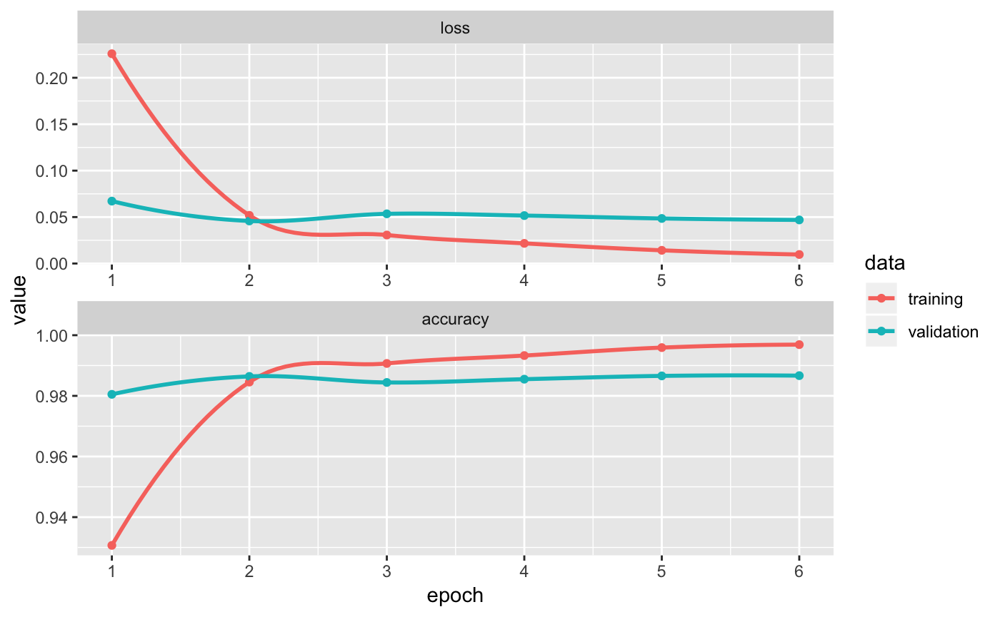
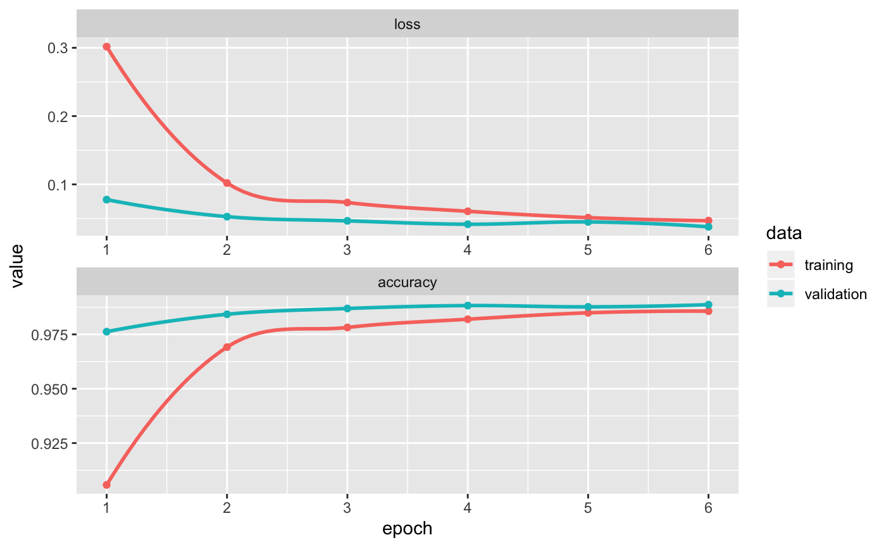

## Exercise one: Identifying handwritten numbers

### Install packages and load Keras
```{r setup, results="hide", message=FALSE, warning=FALSE, echo=FALSE}
def.chunk.hook  <- knitr::knit_hooks$get("chunk")
knitr::knit_hooks$set(chunk = function(x, options) {
  x <- def.chunk.hook(x, options)
  ifelse(options$size != "normalsize", paste0("\\",
                                              options$size,
                                              "\n\n",
                                              x,
                                              "\n\n \\normalsize"),
         x)
})

set.seed(1)

library(keras)
library(kerasR)
library(knitr)
library(papeR)
library(xtable)
library(readtext)
library(tidyverse)
library(tensorflow)
library(reticulate)

Sys.setenv(TENSORFLOW_PYTHON="/Library/Frameworks/Python.framework/Versions/3.7/bin/python3.7")
reticulate::use_python("/Library/Frameworks/Python.framework/Versions/3.7/bin/python3.7")
kerasR::keras_init()
```


### Donwload the mnist dataset
```{r donwload_mnist, cache=TRUE}
mnist <- dataset_mnist()

# Understand dimensions of the dataset
dim(mnist$train$x)
```


### Data preparation

Create new variables to avoid overwriting the original images. 
```{r data_preparation, cache=TRUE}
x_train <- mnist$train$x
y_train <- mnist$train$y
x_test <- mnist$test$x
y_test <- mnist$test$y
```

Reshape images using 'array_reshape' flattening data to remove spatial relationships.
```{r reshape, cache=TRUE, results="hide"}
x_train <- array_reshape(x_train, c(nrow(x_train), 784))
x_test <- array_reshape(x_test, c(nrow(x_test), 784))

# Check new dimensions
dim(x_train)
dim(x_test)
```

Rescaling the above from grayscale to floating point between 0 and 1.
```{r rescale, cache=TRUE}
x_train <- x_train / 255
x_test <- x_test / 255
```

One-hot encoding the vectors in y into binary classes
```{r hot_encode, cache=TRUE, message=FALSE, warning=FALSE}
y_train = keras::to_categorical(y_train, 10)
y_test = keras::to_categorical(y_test, 10)

# Test if it worked
y_train %>% as_tibble %>% head(5)
```

### Model definition
Create models as given by the assignment.
```{r definition_1, cache=TRUE}
model <- keras_model_sequential()

model %>%
 layer_dense(units = 256, input_shape = c(784)) %>%
 layer_dense(units = 10, activation = 'softmax')

# Check resulting model
summary(model)

# Compile the model with loss function, optimizer function and metrics
model %>% compile(
 loss = 'categorical_crossentropy',
 optimizer = optimizer_rmsprop(),
 metrics = c('accuracy')
)
```

### Train the model
```{r train_1, cache=TRUE}
# Verbose is on to help with the debugging of the model
history <- model %>% fit(
 x_train, y_train,
 batch_size = 128,
 epochs = 12,
 verbose = 1,
 validation_split = 0.2 #This is to set aside the 20% of the data to check for performance
)
```


#### Question 2
**Question**: _In the output text in your console, how long did each epoch take to run?_
**Answer**: The model we defined runs for 12 epochs, which on average, on this device, took 2 seconds to run.


#### Question 3
**Question**: _Plot the training history of the model_
**Answer**: See Figure 1 below

```{r history_1, echo = F, fig.cap = "Plot of the training history of the simple model", cache=TRUE}
plot(history)
```


#### Question 4
**Question**: _Describe how the accuracy on the training and validation sets progress differently across epochs, and what this tells us about the generalisation of the model._
**Answer**: Initially accuracy on the training set is lower than on the validation set. Searching on the documentation of Keras this can be due to the fact that training loss and accuracy is the average of the lossess over each batch of the training data, with the first batches of the epoch having higher lossess and lower accuracy. On the other hand, the validation loss of an epoch is computed using the model as it is at the end of the epoch, resulting in lower lossess and higher accuracy. Investigating the development of accuracy and loss across epochs, we can identify that the accuracy on the training set increases as a result of the improvement in the generalisation power of the model. The similarity between the validation and the training set on both accuracy and loss indicates that the model will perform similarly well on out of training data as it performs on training data. Overall, one can say that the model generalises well.


### Training and evaluation

```{r evaluation_1, cache=TRUE}
score <- model %>% evaluate(
 x_test, y_test,
 verbose = 0
)

score_loss <- score$loss
score_accuracy <- score$acc
```


```{r score_1, echo=F, cache=TRUE, eval=FALSE}
paste(c("Score accuracy: ",score_accuracy,"; score loss: ",score_loss))
```


#### Question 5
**Question**: _What values do you get for the model’s accuracy and loss?_
**Answer**: Score accuracy: 0.922800004482269; Score loss: 0.287353911727667


#### Question 6
**Question**: _Discuss whether this accuracy is sufficient for some uses of automatic hand-written digit classification._ 
**Answer**: An accuracy of 92% is clearly not high enough for sensitive application of hand-written digits (e.g. banks' checks). However, a model that could make around 1 mistake every 10 digits could be employed in applications that would not need a high level of accuracy. One of such example could be in the context of a free OCR service where students submit their notes to be converted into digital format. In this example, the user would already have the expectation that the service could create errors in the recognition of digits and therefore would need to manually control and check them.


### Changing model parameters

#### Question 7
_**Question**: _How does linear activation of units limit the possible computations this model can perform?_
**Answer**: A linear activation function cannot perform non-linera mappings from inputs to outputs. In this case it would not matter how many layers there would be present: if all the layers all are linear in nature, the final activation function of last layer is nothing but just a linear function of the input of first layer. If a non-linear decision boundary is required for classification, this is not achievable by a linear activation function.

Creating a new model with the ReLu activation function.

```{r definition_2, cache=TRUE}
model_2 <- keras_model_sequential()

model_2 %>%
 layer_dense(units = 256, input_shape = c(784), activation = 'relu') %>%
 layer_dense(units = 10, activation = 'softmax')

# Summary of model relu
summary(model_2)
```

```{r train_2, cache = TRUE}
# Compile model relu
model_2 %>% compile(
 loss = 'categorical_crossentropy',
 optimizer = optimizer_rmsprop(),
 metrics = c('accuracy')
)
```

```{r train_2.1, cache = TRUE, eval=FALSE}
# Train model relu
history_2 <- model_2 %>% fit(
 x_train, y_train,
 batch_size = 128,
 epochs = 12,
 verbose = 1,
 validation_split = 0.2
)
```

```{r evaluation_2, cache = TRUE, eval=FALSE}
score_2 <- model_2 %>% evaluate(
 x_test, y_test,
 verbose = 0
)
```


#### Question 8
**Question**: _Plot the training history and add it to your answers_
```{r pressure, echo=FALSE, fig.cap="Plot of the training history of the ReLu model", out.width = '100%'}

```


#### Question 9
**Question**: _How does the training history differ from the previous model, for the training and validation sets? What does this tell us about the generalisation of the model?_
**Answer**: 

In Figure X above, we can see that the model with the ReLu activation function ( _model 2_ ) differs significantly from the model with the linear activation function ( _model 1_ ). Comparing the two models, the loss on the training and validation sets was constantly higher in _model 1_ than _model 2_. In the same fashio, the accuracy on both the training and the validation sets was constantly higher for _model 2_ than for _model 1_. The difference in noticeable with decrease in the loss on the validation set of around 0.18 and an increase in the accuracy on the validation set of 0.05.

Therefore, we can expect the model with ReLu activation to generalise slightly better than the model with linear activation. One should use precaution in the forecasting of the generalizability of the model as the model with ReLu has a higher difference in the loss between the training and validation sets.


#### Question 10
```{r score_2, cache=TRUE, eval=FALSE}
score_loss <- score$loss
score_accuracy <- score$acc
```

**Question**: _How does the new model’s accuracy on test set classification differ from the previous model? Why do you think this is?_
**Answer**: Unsurprisingly, the model with the ReLu activation function scores better on test set than the model with the linear activation function. As a matter of fact the results are: loss: 0.07612472 and accuracy: 0.9809.


## Deep convolutional networks

### Data preparation 

```{r preparation_2, cache=TRUE}
x_train <- mnist$train$x
y_train <- mnist$train$y
x_test <- mnist$test$x
y_test <- mnist$test$y

# Reshape to desired dimension to account for colours
x_train <- array_reshape(x_train, c(nrow(x_train), 28, 28, 1))
x_test <- array_reshape(x_test, c(nrow(x_test), 28, 28, 1))

dim(x_train)
dim(x_test)

# Rescale results from 0 to 1
x_train <- x_train / 255
x_test <- x_test / 255

# Categorical variables
y_train <- keras::to_categorical(y_train)
y_test <- keras::to_categorical(y_test)
```


### Model definition

```{r definition_3, cache=TRUE}
model_3 <- keras_model_sequential() %>%
 layer_conv_2d(filters = 32, kernel_size = c(3,3),
               activation = 'relu', input_shape = c(28,28,1)) %>%
 layer_conv_2d(filters = 64, kernel_size = c(3,3),
               activation = 'relu') %>%
 layer_max_pooling_2d(pool_size = c(2,2)) %>%
 layer_flatten() %>%
 layer_dense(units = 128, activation = 'relu') %>%
 layer_dense(units = 10, activation = 'softmax')

summary(model_3)
```

```{r train_3, cache = TRUE}
# Compile model with backpropagation of error procedure
model_3 %>% compile(
 loss = 'categorical_crossentropy',
 optimizer = optimizer_adadelta(),
 metrics = c('accuracy')
)
```


```{r train_3.1, cache = TRUE, eval=FALSE}
# Fit the model with only 6 epochs
history_3 <- model_3 %>% fit(
 x_train, y_train,
 batch_size = 128,
 epochs = 6,
 verbose = 1,
 validation_split = 0.2
)
```


#### Question 11
**Question**: _Plot the training history_
```{r pressure_2, echo=FALSE, fig.cap="Plot of the training history of the deep CNN model", out.width = '100%'}

```

#### Question 12
**Question**: _How does the training history differ from the previous model, for the training and validation sets? What does this tell us about the generalisation of the model?_
**Answer**: Overall the training history of the deep convolutional model improves faster and achieves a higher accuracy score and a lower loss score than the simpler model only with ReLu. The performance of the training and the validation sets converges quickly, around the 3rd epoch, and ends up being very similar around the 6th epoch. Therefore, it is safe to say that the model is likely to perform at similar accuracy and loss levels also on the test set. Given the improvements in the scores and the smaller differences between the training and validation set scores, one can safely say that this model probably generalises better than the simpler one. In practical terms, this would mean that the difference between the test and the training scores will be smaller than with the simpler model.

```{r evaluation_3, cache = TRUE, eval=FALSE}
score_3 <- model_3 %>% evaluate(
 x_test, y_test,
 verbose = 0
)
```

#### Question 13
**Question**: _What values do you get for the model’s accuracy and loss?_
**Answer**: loss: 0.0332674; accuracy: 0.9901


#### Question 14
**Question**: _Discuss whether this accuracy is sufficient for some uses of automatic hand-written digit classification._
**Answer**: The accuracy could be considered sufficient for some uses of automatic hand-written digit classification; in particular, this would concern applications in which 1 classification mistake each 100 samples is considered acceptable. In the context of postal code digit recognition, where the postal code can be verified with the remaining address information, this level of accuracy could be considered sufficient for the implmentation of this model into production.


#### Question 15
**Question**: _Describe the principles of overfitting and how dropout can reduce this_
**Answer**: Large neural nets trained on small datasets can overfit the training data. This may result in the model not learning the signal in the training data but rather learning the statistical noise, resulting in poor performance when the model is tested on new, never seen data (e.g. a test dataset). In this context, dropout, which means randomly dropping out nodes of the network, is a computationally cheap way of reducing overfitting and improving the generalization of the model. This process helps improving the quality of the model by potentially correcting mistakes from prior layers. Because the inputs of the model are dropped at random and are not always present during training the layer learns to use all of its inputs, improving generalization.


### CNN with Dropouts

```{r definition_4, cache=TRUE}
model_4 <- keras_model_sequential() %>%
        layer_conv_2d(filters = 32, kernel_size = c(3,3),
                      activation = 'relu', input_shape = c(28,28,1)) %>%
        layer_conv_2d(filters = 64, kernel_size = c(3,3),
                      activation = 'relu') %>%
        layer_max_pooling_2d(pool_size = c(2,2)) %>%
        layer_dropout(rate = 0.25) %>%
        layer_flatten() %>%
        layer_dense(units = 128, activation = 'relu') %>%
        layer_dropout(rate = 0.5) %>%
        layer_dense(units = 10, activation = 'softmax')

summary(model_4)
```

```{r train_4, cache=TRUE}
model_4 %>% compile(
 loss = 'categorical_crossentropy',
 optimizer = optimizer_adadelta(),
 metrics = c('accuracy')
)
```


```{r train_4.1, cache=TRUE, eval=FALSE}
history_4 <- model_4 %>% fit(
 x_train, y_train,
 batch_size = 128,
 epochs = 6,
 verbose = 1,
 validation_split = 0.2
)
```


#### Question 16
**Question**: _How does the training history differ from the previous (convolutional) model, for both the training and validation sets, and for the time taken to run each model epoch?_
**Answer**: For both training and validation sets the CNN with dropout takes less time in completing each epoch. Furthermore, and more importantly, in the dropout model the training loss stays above validation loss and the same is valid for the accuracy score (as visible in Figure 3 below). In the CNN model without dropouts this was not the case.

```{r history_4, echo=F, eval=FALSE}
history_4_tibble <- history_4 %>% 
  as_tibble

ggplot(history_4_tibble, aes(epoch, value, colour = data)) +
  geom_point() +
  geom_smooth(se = F) +
  facet_wrap(~metric, ncol = 1, scales = "free") +
        scale_x_continuous(breaks = c(1,2,3,4,5,6))
```

```{r pressure_3, echo=FALSE, fig.cap="Plot of the training history of the CNN model with dropouts", out.width = '100%'}

```

#### Question 17
**Question**: _What does this tell us about the generalisation of the two models?_
**Answer**: Among the previously tested models, this model is the top performer in its ability of generalising. Training and validation sets score very similarly in both loss and accuracy scores.


## Exercise two: Identifying objects from images

### Donwload the CIFAR dataset
```{r download_cifar, cache = TRUE, eval=FALSE}
# The method from the exercise book did not work at all
cifar_10 <- keras::dataset_cifar10()
```


### Data preparation
```{r preparation_cifar, cache=TRUE, eval=FALSE}
y_train_cifar <- cifar10$train$y 
y_test_cifar <- cifar10$test$y
x_train_cifar <- x_train_cifar/255 
x_test_cifar <- x_test_cifar/255 
y_train_cifar <- to_categorical(y_train_cifar, 10) 
y_test_cifar <- to_categorical(y_test_cifar, 10)
```


#### Question 18
**Question**: _What code did you use to define the model described here?_
**Answer**: See chunk below.

```{r definition_cifar, cache=TRUE}
model_5 <- keras_model_sequential() %>%
        layer_conv_2d(filters = 32, kernel_size = c(3,3),
                      activation = 'relu', input_shape = c(32, 32, 3), padding = "same") %>%
        layer_conv_2d(filters = 32, kernel_size = c(3,3),
                      activation = 'relu') %>%
        layer_max_pooling_2d(pool_size = c(2,2)) %>%
        layer_dropout(rate = 0.25) %>%
        layer_conv_2d(filters = 32, kernel_size = c(3,3),
                      activation = 'relu', padding = "same") %>%
        layer_conv_2d(filters = 32, kernel_size = c(3,3),
                      activation = 'relu') %>%
        layer_max_pooling_2d(pool_size = c(2,2)) %>%
        layer_dropout(rate = 0.25) %>%
        layer_flatten() %>%
        layer_dense(units = 512, activation = 'relu') %>%
        layer_dropout(rate = 0.5) %>%
        layer_dense(units = 10, activation = 'softmax')

summary(model_5)
```

```{r compilation_cifar, cache=TRUE, eval=FALSE}
model_5 %>% compile(
 loss = 'categorical_crossentropy',
 optimizer = optimizer_rmsprop(lr = 0.0001, decay = 1e-6),
 metrics = c('accuracy')
)
```

```{r history_5, cache=TRUE, eval=FALSE}
history_5 <- model_5 %>% fit(
 x_train_cifar,
 y_train_cifar,
 batch_size =32, 
 epochs = 20,
 verbose = 1,
 validation_data = list(x_test_cifar, y_test_cifar), 
 validation_split = 0.2
)
```


#### Question 19
**Question**: _Execute this model fit command. After your fitting is finished, plot the training history and put it in your answers_
**Answer**:

```{r history_6, cache=TRUE, echo=F}
history_5_csv <- read_csv("images/history_cifar.csv")

ggplot(history_5_csv, aes(epoch, value, colour = data)) +
  geom_point() +
  geom_smooth(se = F) +
  facet_wrap(~metric, ncol = 1, scales = "free")
```


#### Question 20
**Question**: _How does the training history differ from the convolutional model for digit recognition? Why do you think this is? _
**Answer**: The accuracy and loss function seem to take more epochs before they plateau for the cifar model than for the digit recogniser. This is because it takes the model longer to figure out the patterns in the data. The training loss is slightly higher than the validation loss.


#### Question 21
**Question**: _How does the time taken for each training epoch differ from the convolutional model for digit recognition? Give several factors that may contribute to this difference _
**Answer**: Each epoch took around 150 seconds to run. However, the network is more convoluted and has a much deeper layering system than the previous models used in these assignment. This is the main reason behind the long running time


#### Question 22
**Question**: _Read the research paper “Performance-optimized hierarchical models predict neural responses in higher visual cortex”, available from: http://www.pnas.org/content/pnas/111/23/8619.full.pdf. Write a short (~500 word) summary of the experimental approach and results._
**Answer**: 

**Problem**: Neural encoding of images in higher areas of the ventral stream (especially V4 and IT) is poorely understood and difficult to characterize. Given that lower ventral areas (V1) have been more researched and quantitatively accurate models have been discovered to predict the size of the neuronal response to new images, the paper sets out to develop a modelling approach that could yield a quantitatively accurate model of the Inferior Temporal Cortex. This is to say that the researchers' desire is to find a neural network model that matches human performance on a recognition tasks

**Approach**: Measurement of neuronal ITC responses are carried out on a testing image set consisting of 5760 images of photorealistc 3D objects placed on cluttered natural scenes uncorrelated with object identity. By previous research, these scenes are considereddifficult for a vision system to recognize. The measurements are taken with the use of an electrode arrays that collected responses to each image from 168 ITC neurons. 
Then high throughput computational methods were used to evaluate neural network models on the same image set using SVMs with cross-validation testing to measure categorization performance, as well as standard regression to assess models' neural predictivity. 
Models were selected by random draws by one of three procedures: random sampling of uniform distribution from a large parameter space, optimization for performance on an object categorization task or explicit IT predictivity optimization. Each model was specified by a set of 57 parameters controlling the number of layers and parameters, with network depth ranging from one to three layers. All the models are created to be consistent with the HLN hypothesis that higher level neurons output a linear weighting of inputs from intermediate neurons.

**Results**:
The steps followed show that there is optimization involved to directly guide neural mechanisms. The optimization is bounded by the two biological contraints of recognition performance the the structural constriant imposed by the network being hierarchical. A model with perfect neural predictivity in ITC will exhibit high performance because the ITC itself does. The converse being true is demonstrated within a biologically plausible model class which is made by combining high throughput computational and electrophysiology techniques to explore biologically plausible hierarchical neural network models and then measure them against V4 and ITC. This is also used to show that there is a strong correlation between a model's performance on high variation object recognition and translating it to predict individual ITC neuron firings. It is also proved that top down performance thresholds directly shape the intermediary visual representations.


## Exercise three: Play time


#### Question 23
**Question**: _Play around with these settings and see how they affect your ability to learn classification of different data sets._
**Answer**: 

##### Findings:
On this playground one can either choose to classify blue and orange points, or test regression problems. In the classification example, which is the most interesting in my opinion, the classification depends on the position of the points in a two-dimensional space (a 2d image). The data set consists of different coordinates classified as blue or orange and the objective of the user is to test different neural networks that can reliably figure out if a given point should be blue or orange and then predict its class. Each neural network only works with these two values and starts off weighting these points equally. 

The main body of the page is occupied by a point and click interface which allows the user to build his/her own neural network. The neural network is build so that each of the inputs are connected to neurons in the hidden layer by using weights which can be manually adjusted/manipulated to create the learning that the user want. These weights are fed into more hidden layer or the output neuros, depending on the choice of the user. Finally, the output neuron(s) ultimately predict which classification should be outputted. In this case, the problem is a simple binary classification problem, i.e. either blue or orange. Thus, in theory we would only need a single output neuron if the neural network would have been built adequately.

##### Settings:
Some lessons learned by playing around with the settings:
* **Learning rate**: The learning rate is one of the most important hyperparameters and decides at which rate the weights are learned. This can be also called "step size" as it directly influences the amount that the weights are changed at each epoch. In theory, one does not want the learning rate to be to high, otherwise every mistake will bring about large changes in the network and the network could "overshoot" the optimum and end up in a situation where it cannot manage to "find its way" back to the optimum. On the other hand, a small learning rate leads to very slow learning of the model, making the training/ learning of the model computationally and time-expensive. From the time spent tweaking the models, this is what actually happens in practice: with a learning rate of 0.0001 the model does eventually reach a good performance, but the time it takes is indicative of the fact that reducing the learning rate is not a good strategy to achieve better models.
  
*	**Activation**: The activation function defines relation between input of a neuron and the output. A linear relation leads to an increase in output equal to increase in input. ReLu, Sigmoid, or Tanh, impose certain thresholds and enable non-linearity to enter into the model. It is common knowledge that today we should use ReLu instead of Sigmoid or Tanh. However, in the examples at hand, one cannot easily see differences between these activation functions.

* **Regularization**: Kind of smooths the model prediction. Reduces the variability of the model and consequently can prevent overfitting.
  
* **Regularization rate**: How much the model is regularised.

* **Problem type**: Classification/regression
  
* **Ratio of training to test data**: How much of the data should be used for training the model and how much should be used to test the model?

*	**Noise**: How large should the irreducible error of the data be?

*	**Batch size**: The number of datapoints that are used per iteration to train the network. The smaller, the more accurate, yet it takes longer.

*	**Input features**: What features do we use to categorise the x and y coordinates?
  
* **Hidden layers**: How many hiddenlayers do we use.

*	**# neurons**: How many neurons does each layer have?


#### Question 24: 
**Question**: _What is the minimum you need in the network to classify the spiral shape with a test set loss of below 0.1?_
**Answer**: 

* Learning rate: 0.003
* Activation: Sigmoid
* Regularization: L2
*	Regularization rate: 0 (default)
*	Problem type: Classification
*	Ratio of training to test data: 90:10
*	Noise: 0 (default)
*	Batch size: 1
*	Input features: X1, X2, Sin(X1) and Sin(X2)
*	Hidden layers: 1 with 3 neurons

The screenshot of these settings is visible in the figure below.

```{r, echo=F, cache=TRUE}

```


## Exercise four: Low-level functions

#### Question 25
**Question**: _Write a simple function that achieves the convolution operation efficiently for two-dimensional and three-dimensional inputs. This should allow you input a set of convolutional filters (‘kernels’ in Keras’s terminology) and an input layer (or image) as inputs. The input layer should have a third dimension, representing a stack of feature maps, and each filter should have a third dimension of corresponding size. The function should output a number of two-dimensional feature maps corresponding to the number of input filters, though these can be stacked into a third dimensional like the input layer. Give your code as the answer._
**Answer**:

```{r, cache=TRUE, eval=FALSE}
library(png)
library(grid)
library(EBImage)
library(OpenImageR)

orig <- readPNG("images/car.jpeg")
img <- resize(orig, 100, 100)

standardise <- function(x){(x-min(x))/(max(x)-min(x))}
imgshow <- function(x){grid.raster(standardise(x))}

r_img <- matrix(img[,,1], nrow=100)
print(dim(r_img))
imgshow(r_img)

dim(img) # 3 dimension, third is colour
filter <- matrix(c(1,2,1, 0,0,0, -1,-2,-1), ncol = 3, nrow = 3) # edge detection by "Sobel operator"

convolution <- function(input, filter) {
  f_s <- dim(filter) # filter size 
  
  conv <- matrix(0, nrow = (nrow(input) - f_s[[1]]), ncol = (ncol(input) - f_s[[2]]))
  
  for (row in 1:(nrow(input) - f_s[[1]])) {
   for (col in 1:(ncol(input) - f_s[[2]])) {
     step <- input[row:(row + f_s[[1]] -1), col:(col + f_s[[2]] -1)] # no padding
     conv[row, col] <- sum(step * filter)
   }
  }
}

img_conv <- convolution(img, filter)
```


#### Question 26 
**Question**: _Write a simple function that achieves rectified linear (relu) activation, with a threshold at zero. Give your code as the answer._
**Answer**:

```{r, cache=TRUE, eval=FALSE}
# This function works for a 2D tensor
relu_function <- function(x) {
  for (i in nrow(x))
    for (j in ncol(x))
      x[i, j] <- max(x[i, j], 0) 
  x 
}
```

#### Question 27
**Question**: _Write a simple function that achieves max pooling. This should allow you to specify the spatial extent of the pooling, with the size of the output feature map changing accordingly. Give your code as the answer._
**Answer**: 

```{r, cache=TRUE, eval=FALSE}
library(png)
library(EBImage)
library(OpenImageR)

orig <- readPNG("images/car.jpeg")
img <- resize(orig, 100, 100)

pooling <- function(image, filter, stride) {
    f <- filter
    s <- stride 
    
    # get image dimensions
    orig_col <- dim(image[,,1])[2]
    orig_row <- dim(image[,,1])[1]
    
    # New image dimensions depending on filter and stride
    new_c <- (orig_col-f) / s+1
    new_r <- (orig_row-f) / s+1  
    
    # Create new image array with new dimensions
    newImage <- array(0, c(new_c, new_r, 3))
    
    # Go thorugh RGB layers
    for(rgb in 1:3)
    {
      m <- image[,,rgb]
      m3 <- matrix(0, ncol = new_c, nrow = new_r)
      i <- 1
      for(ii in 1:new_r) {
          j=1
          for(jj in 1:new_c) {
              m3[ii,jj] <- max(as.numeric(m[i:(i+(f-1)), j:(j+(f-1))])) #max part of the pooling
              j <- j+s
          } 
          i <- i+s
      }
      newImage[,,rgb] <- m3
    }
return(newImage)
}

image_max <- pooling(img, 2, 2)
plot(as.raster(pmax), title = title("Max-Pooled (c(2,2),2)"))
```


#### Question 28
**Question**: _Write a simple function that achieves normalisation within each feature map, modifying the feature map so that its mean value is zero and its standard deviation is one. Give your code as the answer._
**Answer**:

#### Question 29
**Question**: _Write a function that produces a fully-connected layer. This should allow you to specify the number of output nodes, and link each of these to every node a stack of feature maps. The stack of feature maps will typically be flattened into a 1dimensional matrix first._
**Answer**:

#### Question 30
**Question**: _Write a function that converts the activation of a 1-dimensional matrix (such as the output of a fully-connected layer) into a set of probabilities that each matrix element is the most likely classification. This should include the algorithmic expression of a softmax (normalised exponential) function._
**Answer**:

#### Question 31
**Question**: _Explain the principle of backpropagation of error in plain English. This can be answered with minimal mathematical content, and should be IN YOUR OWN WORDS. What is backpropagation trying to achieve, and how does it do so?_
**Answer**: 

To explain the principle of backpropagation one cannot avoid the usage of "mathematical" content and therefore one must first define the symbols that will be used.
If we have a network $$n$$ composed by two tensor operations $$a,b$$ with weight matrices $$W1, W2$$. Our network can be represented by the following expression:

```{r, eval=FALSE}
n(W1, W2) = a(W1, b(W2))
```

To differenciate this chain of function, one can use the chain rule $$f(g(x)) = f'(g(x)) * g'(x)$$. Using the chain rule to the computation of the gradient values of a neural network creates what is called backpropagation.

In this context, the gradient is the derivative in a determined point of the tensor operation. The loss gradient is the gradient of the function that maps the values to loss values. To explain better, given vector $$x$$, matrix $$M$$, target $$y$$ and a loss function, one can use $$M$$ to compute a target candidate $$pred_y$$ and compute the mismatch between this target and the real target $$y$$.

```{r, eval=FALSE}
pred_y <- dot(M, x) # where dot is the dot product of the vector/matrix
loss_value <- loss(pred_y, y)
loss_value <- f(M)
```

The tensor $$gradient(f(M0))$$ is the gradient of the function $$f(M)$$ in $$M0$$.

By computing the gradient of the loss wrt to the parameters of the network and the moving these parameters in the opposite direction from the gradient, one can reduce the loss on the batch. This is the gradient descent which allow us to reduce the loss values and therefore train a better algorithm.

A neural-network consists of many tensor operations chained together, and each one of them has a simple derivative which is known. In this context, backpropagation starts with the final loss value from the chain of functions that represent a neural network and works backward from the top layers to the bottom layer applying the chain rule to compute the contribution that each parameter had in the loss value.